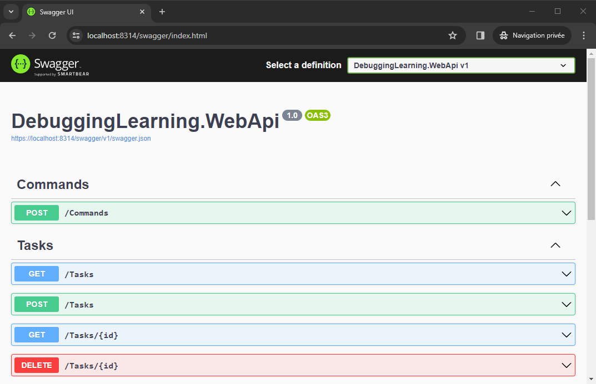

# Setup locally

## Prerequisites
- [.NET 8.0](https://dotnet.microsoft.com/en-us/download/dotnet/8.0)

## How to run locally

Navigate to solution folder and run the following command:
```
dotnet restore
dotnet build
```

### API

Navigate to the 'bin' folder and run the following:
```
dotnet DebuggingLearning.WebApi.dll --urls="http://0.0.0.0:8313;https://0.0.0.0:8314"
```

Now, you can browse the following url: [https://localhost:8314/swagger/index.html](https://localhost:8314/swagger/index.html)

